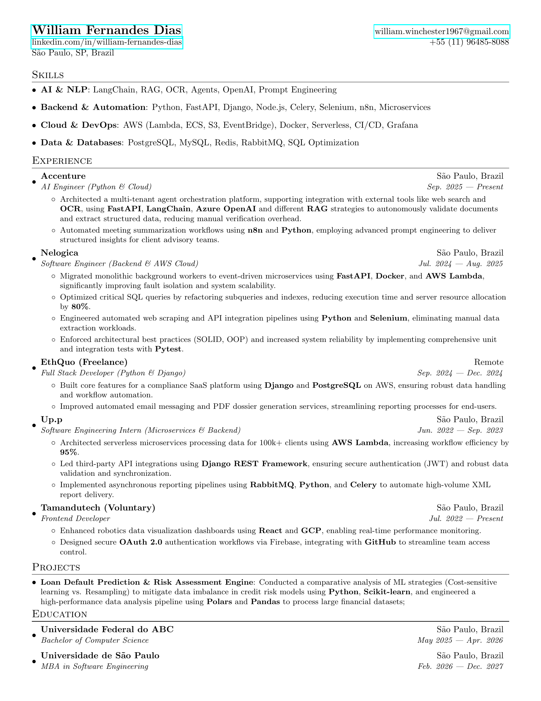

# CV

This repository contains my professional CV/resume, written in LaTeX.

## Preview



## Structure

The CV is modular, with each section in a separate file:

- `cv.tex` - Main document with preamble and structure
- `sessions/heading.tex` - Header with contact information
- `sessions/skills.tex` - Technical skills
- `sessions/experience.tex` - Work experience
- `sessions/projects.tex` - Personal projects
- `sessions/education.tex` - Education background

## Building

Compile the CV using your preferred LaTeX compiler:

```bash
pdflatex cv.tex
```
